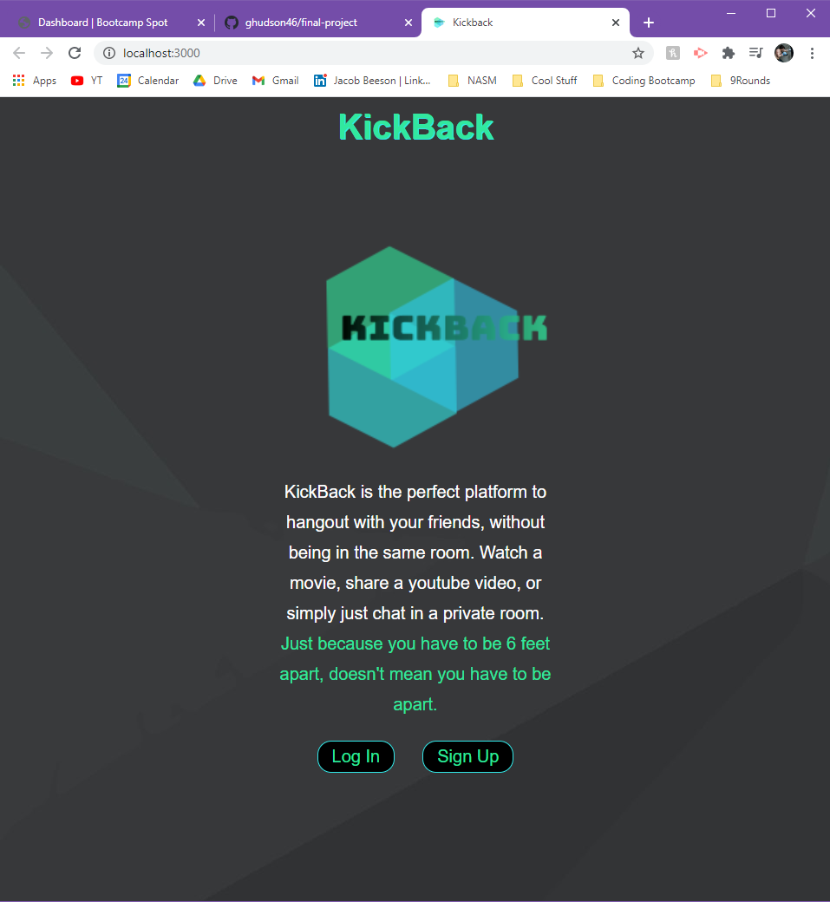
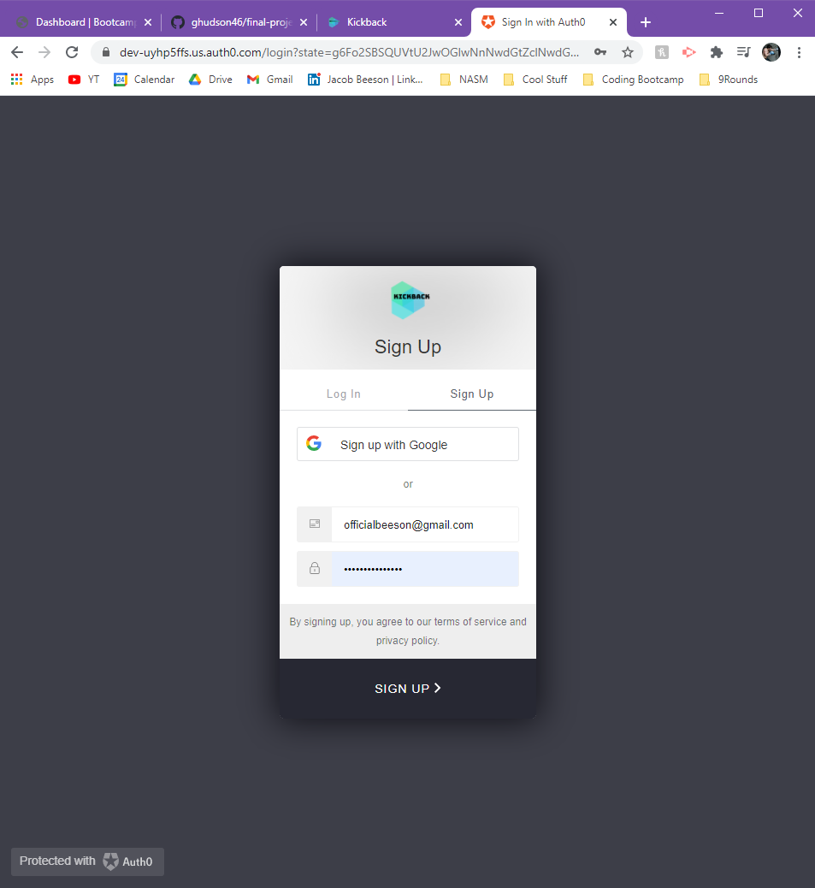
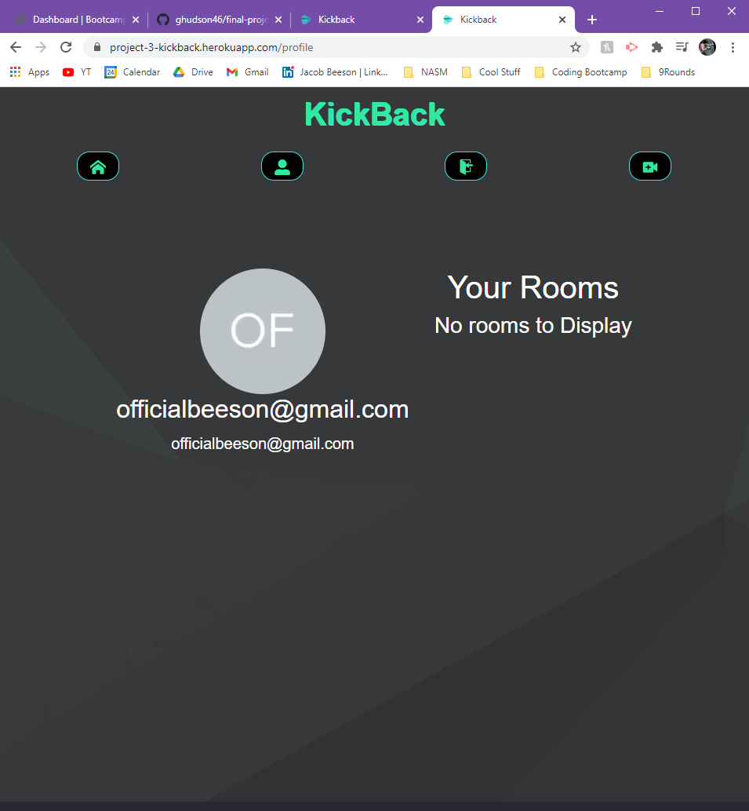
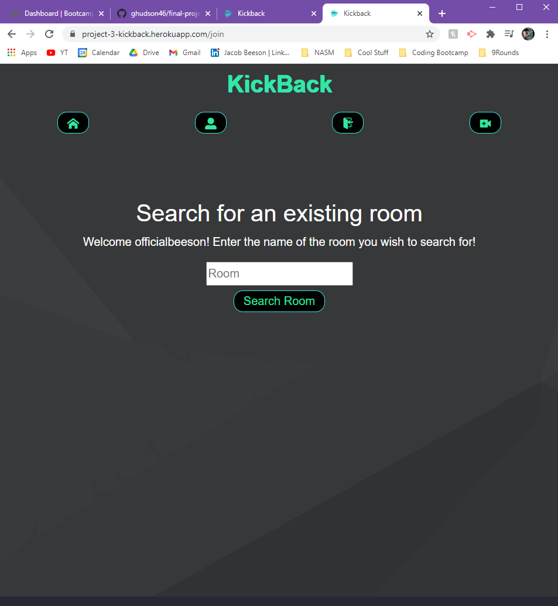
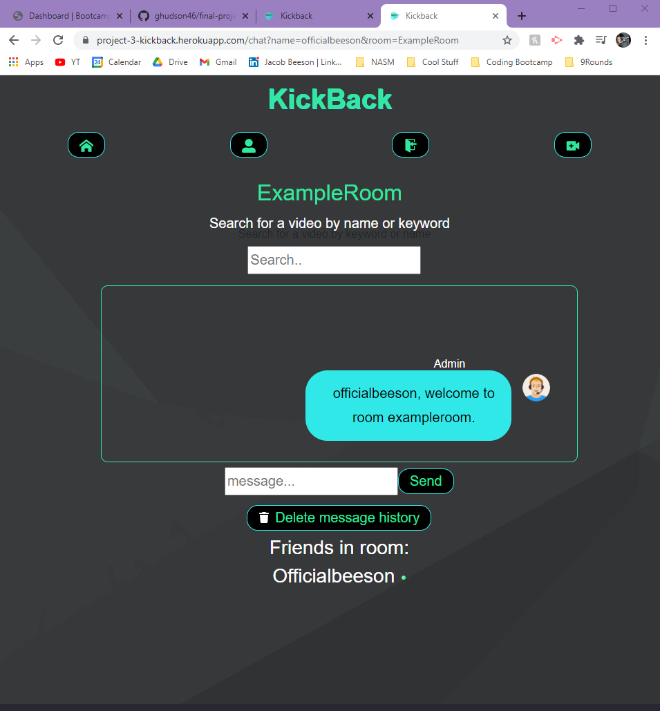

# KickBack

## Description
KickBack is the perfect platform to hangout with your friends, without needing to be in the same room! Watch a movie, share a youtube video, or simply just chat in a private room.
Just because you have to be 6 feet apart, doesn't mean you have to be apart.
## Table of Contents

  - [Repository](#Repository)
  - [Installation](#Installation)
  - [Demo](#Demo)
  - [Contributors](#Contributors)
  - [Technologies Used](#Technologies&nbsp;Used)
  - [Future Development](#Future&nbsp;Development)

## Repository
The repository containing the application's can be found here:
[Repository Link](https://github.com/ghudson46/final-project)

To deployed application can be found here:
[Deployed Application](https://project-3-kickback.herokuapp.com/)

## Installation
  Accessing the deployed application using the link above requires no installation process. To access the project locally, follow the steps below:
  * Navigate to the project's [github repository](https://github.com/ghudson46/final-project)
  * Click the green "Code" button, and clone the repository, or download the ZIP file.
    * If cloning the repository, open up your terminal, navigate to a directory you would like to store the project, and run "git clone https://github.com/ghudson46/final-project.git"
    * If downloading via ZIP file, navigate to the download folder, right click the ZIP file and click "Extract All...", and extract the file to your desired directory.
  * Go to the project's location in your File Explorer, open the intial folder, and drag the duplicate folder outside into the directory. This should automatically replace the duplicate folder. This step allows the user to avoid issues regarding package installment.
  * Open up the project in your code editor (VSCode). Right click the main project folder and select "Open in Integrated Terminal." Make sure the directory is displayed as "../final-project", with the "../" being the predecessor directories that your project is within.
  * In the command line, run npm install. *Note: node.js must be installed for this application to run. For further information, please visit: https://nodejs.org/en/ 
  * Now that all packages are installed, run the project locally by entering "npm start" in the command line. The server should automatically open from here!

## Demo
This application can be accessed and used through [Heroku](https://project-3-kickback.herokuapp.com/).

The user may Log in or Sign Up. When signing up, the user may either auto-create an account by signing up with google, or by typing in an email and a new password.

Once the user is logged in, they can navigate through Home, Profile, Join Room, and Create Room. The profile page will display the user's name, email, and google picture if the user signed up with Google. If the user used a default email, a placeholder image will be displayed along with their email. The profile page will also display past rooms the user has created or joined.

Both the join room and create room pages show similar displays. The user may enter in a previously created room name on the join page to enter a room, or create a new room on the create room page by typing in a unique room name.

On the room page, we are able to search for a video utilizing the YouTube API. The page will be auto-populated with the first video that would come up from a regular youtube search. The chat box is displayed next, which display all message entered by all users. You may Delete message history, and all users currently in the room are displayed at the bottom of the screen.

## Contributors
* [Dianna Mack](https://github.com/dmack095-07) dianna.mack@yahoo.com
* [Garrett Hudson](https://github.com/ghudson46) garrett.hudson46@gmail.com
* [Jake Beeson](https://github.com/jpbeeson) beeson.jp@gmail.com
* [Toks Desalu](https://github.com/desalu) desalu.developer@gmail.com
* [Grant Zepke](https://github.com/23gzepke) grantzepke@gmail.com
* [Sean Cummings](https://github.com/SeanPCummings) seanpc1028@gmail.com

## Technologies Used
* Node JS
* Express
* MySQL
* React
* MongoDB
* Heroku
* Bootstrap

## Future Development
* add the ability to sync video so a room host can control the video playback
* add ability to delete individual messages
* search for user's profiles
* make into mobile app with PWA

